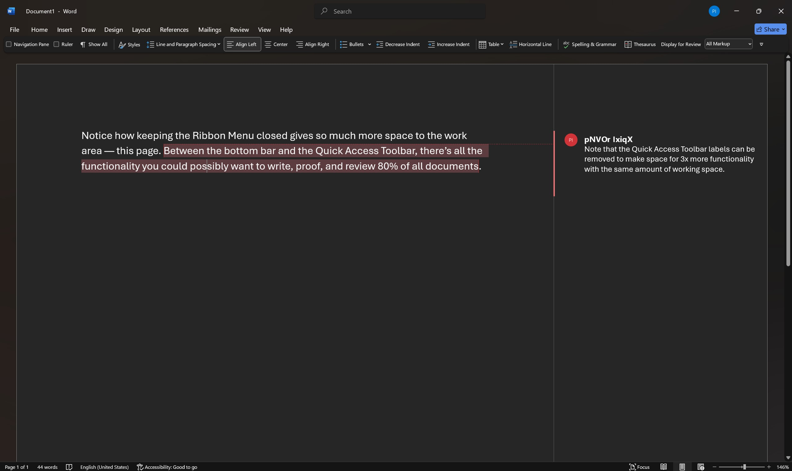
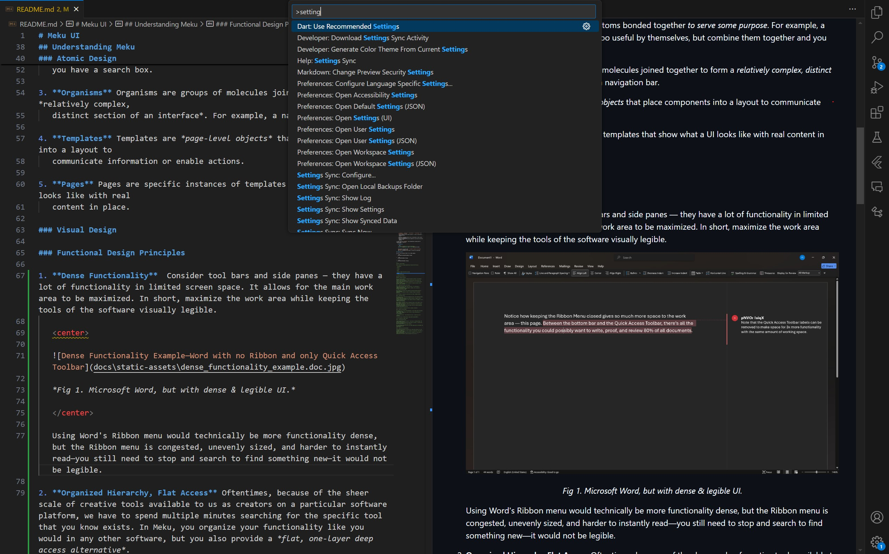
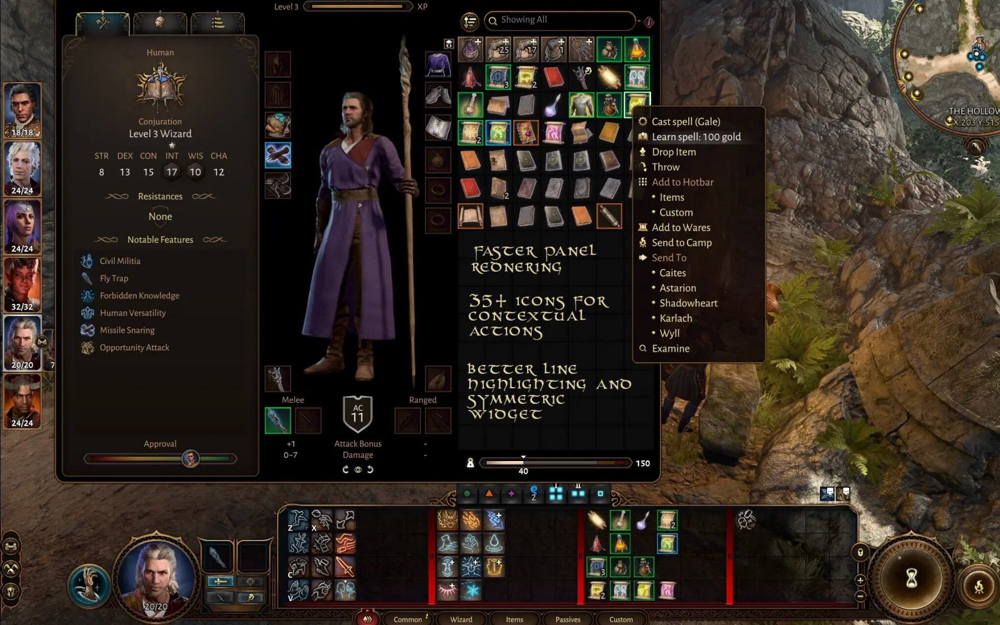
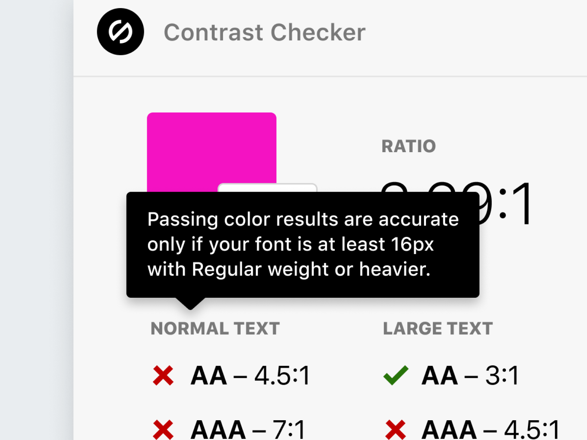
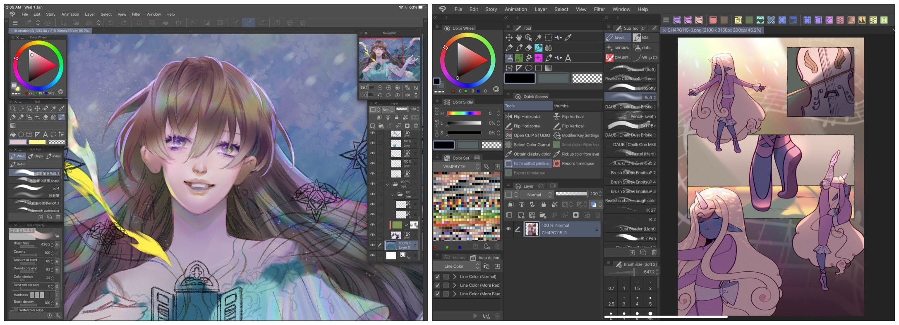

# Meku UI

<p aligh="center"> <br/>

| UI Design System     | Use Case                                                                                                     | Visual Style                                                                                                          |
| -------------------- | ------------------------------------------------------------------------------------------------------------ | --------------------------------------------------------------------------------------------------------------------- |
| Material 3           | Android-first Adaptive Applications with consistent experience across devices                                | Flat design with emphasis on color, typography, and spacing.                                                          |
| Fluent               | Windows-first Adaptive Applications with a focus on natural interaction and device specific controls/layouts | Acrylic effect (glass morphism), depth effects, and a focus on natural light and motion.                              |
| IBM Carbon           | Focus on simplicity, clarity, and accessibility. Especially for data visualization and documentation.        | Flat design with a focus on clean lines, neutral colors, and a sans-serif typeface.                                   |
| Ant Design           | Focus on efficiency, performance, and a responsive design for enterprise applications                        | Flat design with a focus on simplicity, clarity, and a consistent experience across different (desktop) screen sizes. |
| Foundation/Bootstrap | Responsivity & Modularity for web applications                                                               | Flat design with a focus on simplicity, clarity, and a consistent experience across different screen sizes.           |

<p align="center"> <em> Table 1. Most UI Libraries are aimed at a very specific use case. </em> </p>

<br/> </p>

<hr/>

メイク /meɪkuː/ (*Romanji **me-ku***) **1. *verb*** form (something) by putting parts together or
combining substances; create **2. *verb*** cause (something) to exist or come about; bring about.
**3. *verb*** constitute; amount to; develop into.

<hr/>

<br/>

As the definition implies, Meku is primarily targeted at applications meant for creating things. and
is inspired by the UIs of creative applications like:

- Code IDE's (eg. VS Code, Dreamweaver, Visual Studio)

- Editing software (eg. Photoshop, Premier Pro, Lightroom)

- Art software (eg. Clip Studio Paint, Blender, Krita)

- Engineering software (eg. SolidWorks, Ansys)

- Game UI (eg. Baldur's Gate 3, Cyberpunk 2077)

The aim is to allow you a minimal UI toolkit that allows you to create User Interfaces that look
good and help users create what they want without having to fight/learn the application itself —
**basically, good Creative Application UI made easy.**

## Understanding Meku

> ⚠️ Docs generated with dartdoc and/or hosted on pub.dev will not display images, consider
> reading this document on Github

### Atomic Design

Meku is organized based on the
[Atomic Design Principles](https://bradfrost.com/blog/post/atomic-web-design/) where Atoms →
Molecules → Organisms → Templates → Pages:

1. **Atoms** The basic building blocks of the UI such as a form label, an input, or a button. Atoms
   can also include more abstract elements like color palettes, fonts and even more invisible
   aspects of an interface like animations.

2. **Molecules** Molecules are groups of atoms bonded together *to serve some purpose*. For example,
   a form label, input, and button aren’t too useful by themselves, but combine them together and
   you have a search box.

3. **Organisms** Organisms are groups of molecules joined together to form a *relatively complex,
   distinct section of an interface*. For example, a navigation bar.

4. **Templates** Templates are *page-level objects* that place components into a layout to
   communicate information or enable actions.

5. **Pages** Pages are specific instances of templates that show what a UI looks like with real
   content in place.

### Visual Design

### Functional Design Principles

1. **Specialized & Dense Functionality,** Consider tool bars and side panes — they have a lot of
   functionality in limited screen space. It allows for the main work area to be maximized. In
   short, maximize the work area while keeping the tools of the software visually legible, do this
   by specializing the UI for the given creative application.

   <p aligh="center"> <br/>

   

   <p align="center"> <em> Fig 1. Microsoft Word, but with dense & legible UI. </em> </p>

   <br/> </p>

   Using Word's Ribbon menu would technically be more functionality dense, but the Ribbon menu is
   congested, unevenly sized, and harder to instantly read—you still need to stop and search to find
   something new—it would not be legible.

2. **Organized Hierarchy, Flat Access,** Oftentimes, because of the sheer scale of creative tools
   available to us as creators on a particular software platform, we have to spend multiple minutes
   searching for the specific tool that you know exists. In Meku, you organize your functionality
   like you would in any other software, but you also provide a *flat, one-layer deep access
   alternative*.

   <p aligh="center"> <br/>

   

   <p align="center"> <em> Fig 2. VS Code's Command Palette allows you to access any tool in the
   software with a single search—flat, one-layer deep access. </em> </p>

   <br/> </p>

   You can find almost any single function or setting or tool in VS Code from the Command Palette.
   You only need type one keyboard shortcut (`ctrl` + `shift` + `P`) or click on the command palette
   search bar — one action to find and access any tool. VS Code's command palette is not a perfect
   solution since not e everything can be accessed but a good solution nonetheless.

3. **Contextual Action,** When dealing with an large and overlapping tool-set (e.g. brush vs. pen
   vs. pencil vs. vector tool), the traditional method is to have the user learn the tools and the
   many many relevant shortcuts to speed up their workflow. Not only is this a very steep learning
   curve but it also requires the user to remember a lot of lengthy, intricate, and often arbitrary
   shortcuts.

   Meku attempts to alleviate this by linking the tools to the context of the user's actions. You
   can have a small set of shortcuts that map to different but intuitive actions depending on the
   context. This context based system could also reduce clutter but simply displaying relevant tools
   instead of the entire tool-set all the time.

   <p aligh="center"> <br/>

   

   <p align="center"> <em> Fig 3. Caites/pavelk Baldur's Gate 3 Better Context Menu Mod—note how the
   first two actions are specific to the spell scrolls. </em> </p>

   <br/> </p>

   Another Wonderful example of contextual action in games is where you press the same key to do
   different actions. Like, for example, pressing `E` to open doors when your crosshair is on a
   door, pick up items when your crosshair is on an item, or talk to an NPC when your crosshair is
   on an NPC, etc.

4. **Obvious and Verifiable,** The obvious part is fairly self-explanatory. In case that the purpose
   of something is not clear, the user should have a way to verify if their interpretation is
   correct. Again, fairly self-explanatory.

   <p aligh="center"> <br/>

   

   <p align="center"> <em> Fig 4. The ≤16px font size is something a designer would know, but just
   in case they don't there's clarification. </em> </p>

   <br/> </p>

   While the entirety of Python Enhancement Proposal #20 is relevant to clarity of presentation
   followed by optional verification, it is especially served by this epigram:

   > There should be one -- and preferably only one -- obvious way to do something.
   >
   > *from [The Zen of Python](https://peps.python.org/pep-0020/)*

5. **Customizable/Flexible,** Creative applications are just that—tool-sets for creating things. The
   actual workflow creators use vary from person to person and from project to project. It makes
   sense that the user should be able to setup the UI to suit their workflow.

   No wold-changing inspiration here, just things applications like Blender and Clip Studio have
   been doing forever.

   <p aligh="center"> <br/>

   

   <p align="center"> <em> Fig 5. CLiP Studio Paint—Customizable workspaces and tool interfaces.
   </em> </p>

   <br/> </p>

### Design Rationale behind specific elements

The specific choices behind the design of almost every element in Meku is outlined in the
library-level documentation of the element. Use the below command to generate documentation with
minimal errors.

```ps
PS> dart doc --output docs
```

## Developing Meku

### Library Structure

Meku heavily relies on the `part`/`part of` directives to prevent colossally long files by splitting
libraries into multiple files. The folder/code structure is as follows:

1. Each Element of the UI is organized into one of 4 folders (atom, molecule, organism, template):

   ```text
   ===========================================
   == Example of the structure of a UI Atom ==
   ===========================================

   lib
   └─ atom
      ├─ element
      │  ├─ element_subpart_1.dart
      │  ├─ element_subpart_2.dart
      │  ├─ element_subpart_3.dart
      |  └─ ...
      |
      └─ element.dart (library level explanation/documentation goes here) 
   ```

2. Each subpart contains a ***single*** class or widget.

3. Explicitly use the `library` keyword in the element.dart file.

4. Use the `part`/`part of` directive to split the element into multiple files. (see
   `lib/atom/color/...` for more details)

   - Directory Structure

     ```text
     ================================
     == Example color.dart library ==
     ================================

     lib
     └─ atom
        ├─ color
        │  ├─ color_palette.dart     (uses color_swatch & mhct to generate color palette)
        │  ├─ color_swatch.dart      (color swatch class)
        │  └─ mhct.dart              (HCT wrapper with utility functions)
        |
        └─ color.dart                (combines everything, has library documentation)
     ```

   - The `color_palette.dart`, `color_swatch.dart`, and `mhct.dart` files start with

     ```dart
     part of '../color.dart';
     ```

   - The `color.dart` file starts with

     ```dart
     /// Library Level Documentation
     library color;

     // Imports

     // Sub Parts
     part 'color/mhct.dart';            // Code in mhct.dart is symbolically placed here
     part 'color/color_swatch.dart';    // Code in color_swatch.dart is symbolically placed here
     part 'color/color_palette.dart';   // Code in color_palette.dart is symbolically placed here
     ```

### Variable Naming Conventions

1. - Use dummy variables like `_` or `__` when you need to use a variable but don't need its value.
     This is to avoid the `unused_local_variable` warning.

### Documentation Comment Format

```dart
/// A simple one/two-line description of the class/method
///
/// ### Args (only when args are not self-explanatory)
/// - `argName`: Description of the argument
///
/// ### Errors (only when errors are explicitly thrown)
/// - `ErrorType`: Cause of the error and potential solution
///
/// ### Notes (as per develop descretion)
/// - Note 1
///
/// - Note 2
```

1. Try to avoid using `Args`, `Errors`, and `Notes` unless absolutely necessary, do not mentions
   specific args in the one line description either. Rely on the context provided by the method
   signature if possible.

   - **Example 1** When to avoid Documentation Sub-Sections.

     ```dart
     /// Find the the Color with the closest Hue to the target color from the given colors.
     static Hct closestHue({required Hct targetColor, required List<Hct> candidateColors})
     ```

     Note how `targetColor` and `candidateColors` are not mentioned in the one line description, but
     you still know what they are. All documentation comments carry limited context, use it.

   - **Example 2** When to use Documentation Sub-Sections.

     ```dart
     /// Generate a color palette from a seed color.
     ///
     /// ### Args
     /// - `minHueDist`, `maxHueDist`: Minimum/Maximum distance between any two
     /// color palette hues in deg.
     ///
     /// - `warningTarget`, `surfaceTarget`, and `highlightTarget`: Target colors
     /// for warning/surface/highlight colors (see Note).
     ///
     /// ### Note
     /// - If target colors are specified, the closest color to the target is used
     /// for the corresponding color-function.
     ///
     /// - If no target colors are specified, warning, surface and highlight color
     /// targets are set to red, blue and green respectively.
     ColorPalette.fromSeed(
       Color seedColor, {
       int minHueDist = 90,
       int maxHueDist = 120,
       Hct? warningTarget,
       Hct? surfaceTarget,
       Hct? highlightTarget,
     })
     ```

     - `minHueDist`, `maxHueDist`, `warningTarget`, `surfaceTarget`, and `highlightTarget` are not
       clearly obvious from the method signature, so they are mentioned in the documentation
       comment.

     - Similarly, the default target colors are mentioned in notes section as they are an additional
       pieces of information that may be important to users and not directly relevant to the
       function.

2. Avoid using the `[ClassName]` style documentation linking when the specific class is implied by
   the context.

   - **Example 3**

     ```dart
     /// Convert an ARGB color to the HCT equivalent.
     static Hct fromColor(Color color) => Hct.fromInt(color.value);
     ```

     The one-liner could have been `/// Convert a [Color] to the [Hct] equivalent`, but both `Color`
     and `Hct` are implied by the context, so they are not mentioned.

### Logging Format

Use one of the following formats for all Debug Logging:

1. ```text
    LibraryName/ClassName/MethodName: Message
   ```

2. ```text
    ClassName/MethodName: Message
   ```

3. ```text
    ProcessName/MethodName: Message
   ```

<!-- 

## Meku's Visual Design

Mostly Inspired by Teenage Engineering's Minimal Retro-Futurism

- Thumb Wheels

- Buttons

- Sliders

- Knobs

- Geometric Shapes delimited by grooves

- clicky circles

1. Dense Functionality

2. Limited Color Palette -->
